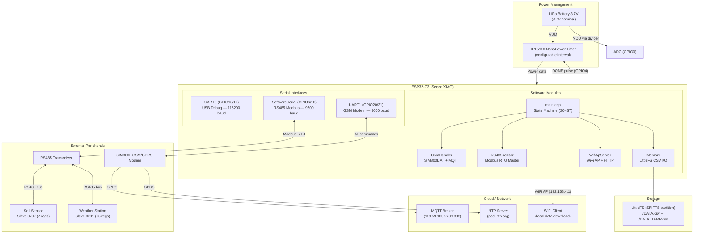
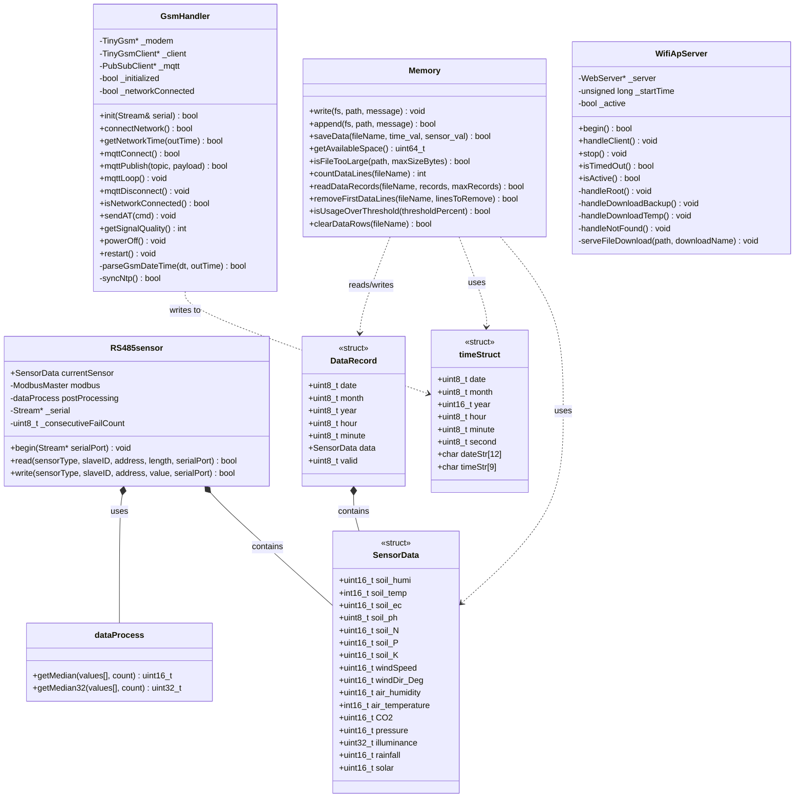
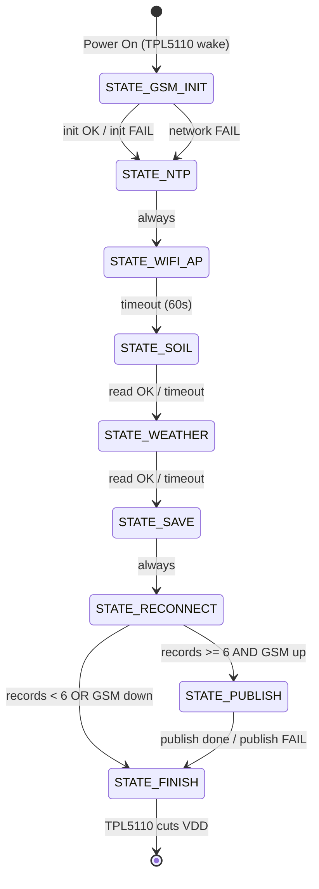
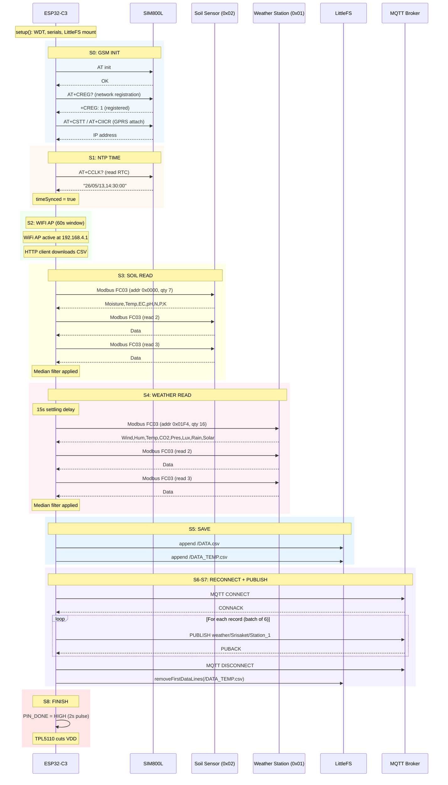
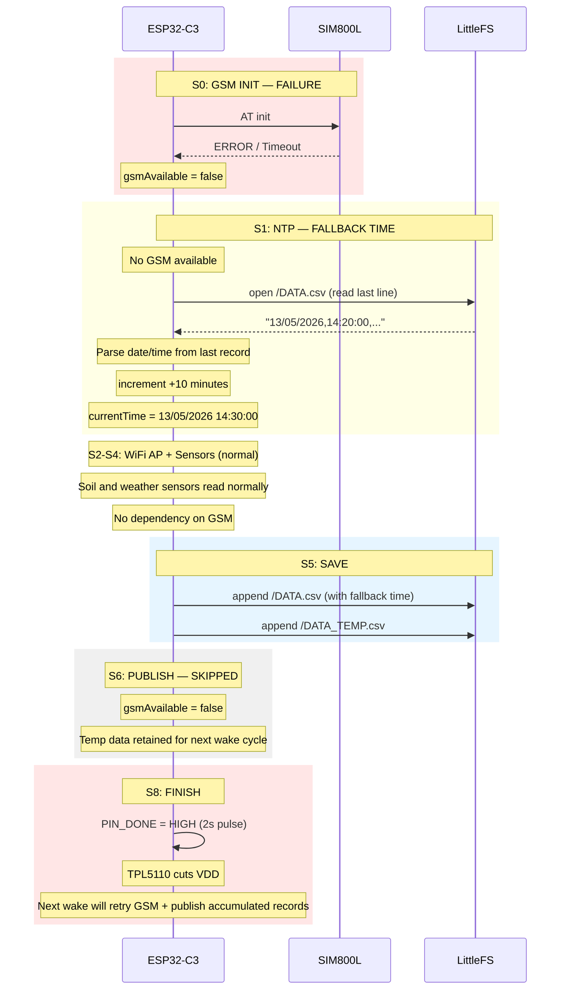
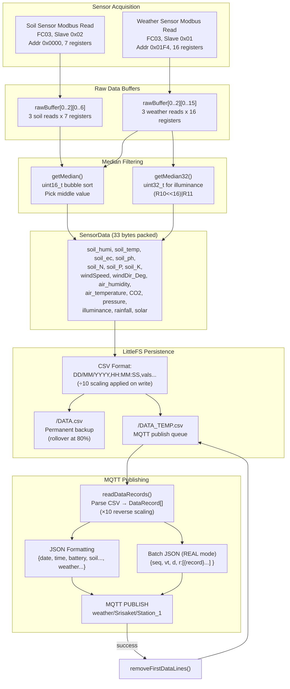

# Embedded Documentation Implementation Plan

> **For agentic workers:** REQUIRED SUB-SKILL: Use superpowers:subagent-driven-development (recommended) or superpowers:executing-plans to implement this plan task-by-task. Steps use checkbox (`- [ ]`) syntax for tracking.

**Goal:** Generate professional Doxygen API docs, 6 Mermaid architecture diagrams, and a formal design specification for the ESP32-C3 weather station firmware.

**Architecture:** Doxygen extracts API docs from annotated `.h`/`.cpp` files into HTML. Six standalone Mermaid diagram `.md` files cover hardware, software, and data flow. A single `design-spec.md` synthesizes everything into a 12-section embedded systems design document. README.md is slimmed down to point to the new docs.

**Tech Stack:** Doxygen 1.9+, Mermaid (GitHub/VS Code native), Markdown, PlatformIO

---

### Task 1: Create directory structure and update .gitignore

**Files:**
- Create: `docs/diagrams/` (directory)
- Create: `docs/api/` (directory)
- Modify: `.gitignore`

- [ ] **Step 1: Create diagram and API directories**

```bash
mkdir -p docs/diagrams docs/api
```

- [ ] **Step 2: Add Doxygen output to .gitignore**

Append to `.gitignore`:

```
docs/html/
```

- [ ] **Step 3: Commit**

```bash
git add .gitignore
git commit -m "chore: add docs directories and gitignore for Doxygen output"
```

---

### Task 2: Write Doxyfile

**Files:**
- Create: `docs/Doxyfile`

- [ ] **Step 1: Create Doxyfile**

Write `docs/Doxyfile` with the following content (this is the minimal Doxyfile — all unset keys use Doxygen defaults):

```doxygen
# Doxyfile — LoRa Weather Base GSM Sensor Node Firmware

#---------------------------------------------------------------------------
# Project related configuration options
#---------------------------------------------------------------------------
PROJECT_NAME           = "LoRa Weather Base - GSM Sensor Node Firmware"
PROJECT_NUMBER         = 1.0
PROJECT_BRIEF          = "ESP32-C3 XIAO weather station with GSM/GPRS, RS485 Modbus, WiFi AP, and MQTT"
OUTPUT_LANGUAGE        = English

#---------------------------------------------------------------------------
# Build related configuration options
#---------------------------------------------------------------------------
EXTRACT_ALL            = YES
EXTRACT_PRIVATE        = NO
EXTRACT_STATIC         = YES
EXTRACT_LOCAL_CLASSES  = YES
HIDE_UNDOC_MEMBERS     = NO
HIDE_UNDOC_CLASSES     = NO

#---------------------------------------------------------------------------
# Configuration options related to the input files
#---------------------------------------------------------------------------
INPUT                  = src include
FILE_PATTERNS          = *.cpp *.h
RECURSIVE              = YES

#---------------------------------------------------------------------------
# Configuration options related to source browsing
#---------------------------------------------------------------------------
SOURCE_BROWSER         = YES
INLINE_SOURCES         = NO
REFERENCED_BY_RELATION = YES
REFERENCES_RELATION    = YES

#---------------------------------------------------------------------------
# Configuration options related to the HTML output
#---------------------------------------------------------------------------
GENERATE_HTML          = YES
HTML_OUTPUT            = html
GENERATE_TREEVIEW      = YES
SEARCHENGINE           = YES
HTML_TIMESTAMP         = YES
HTML_COLORSTYLE_HUE    = 220
HTML_COLORSTYLE_SAT    = 100
DISABLE_INDEX          = NO
GENERATE_LATEX         = NO

#---------------------------------------------------------------------------
# Configuration options related to the preprocessor
#---------------------------------------------------------------------------
ENABLE_PREPROCESSING   = YES
MACRO_EXPANSION        = YES
EXPAND_ONLY_PREDEF     = YES
PREDEFINED             = F(x)=x \
                         PROGMEM= \
                         ICACHE_RODATA_ATTR= \
                         ARDUINO=100 \
                         GF(x)=x
```

- [ ] **Step 2: Commit**

```bash
git add docs/Doxyfile
git commit -m "docs: add Doxygen configuration for API documentation"
```

---

### Task 3: Write custom Doxygen CSS

**Files:**
- Create: `docs/doxygen-custom.css`

- [ ] **Step 1: Create doxygen-custom.css**

Write `docs/doxygen-custom.css`:

```css
/* LoRa Weather Base — Doxygen Custom Stylesheet */

/* --- Layout --- */
#top {
    background: #1a1a2e;
    border-bottom: 3px solid #0f3460;
}

#titlearea {
    padding: 12px 0;
}

#titlearea table {
    color: #e0e0e0;
}

#projectname {
    font-size: 18px;
    font-weight: 700;
    color: #ffffff;
    letter-spacing: 0.5px;
}

#projectbrief {
    font-size: 13px;
    color: #a0a0c0;
}

/* --- Navigation --- */
#navrow1, #navrow2 {
    background: #16213e;
    border-bottom: 1px solid #0f3460;
}

#navrow1 a, #navrow2 a {
    color: #e0e0e0;
}

#navrow1 .tab a:hover, #navrow2 .tab a:hover {
    color: #4fc3f7;
}

/* --- Tree sidebar --- */
div.fragment {
    background: #f8f9fa;
    border: 1px solid #dee2e6;
    border-radius: 4px;
    padding: 10px;
    font-family: 'Consolas', 'Courier New', monospace;
    font-size: 13px;
    line-height: 1.5;
}

/* --- Member descriptions --- */
.memproto {
    background: #f0f4f8;
    border: 1px solid #c8d6e5;
    border-radius: 4px;
    padding: 8px 12px;
    font-weight: 600;
}

.memdoc {
    border-left: 3px solid #0f3460;
    padding-left: 12px;
    margin-left: 0;
}

/* --- Tables --- */
table.memberdecls {
    border-collapse: collapse;
    width: 100%;
}

table.memberdecls th {
    background: #16213e;
    color: #e0e0e0;
    padding: 8px 12px;
    text-align: left;
}

table.memberdecls td {
    border-bottom: 1px solid #dee2e6;
    padding: 6px 12px;
}

/* --- Headings --- */
h2.groupheader {
    color: #0f3460;
    border-bottom: 2px solid #4fc3f7;
    padding-bottom: 6px;
}

/* --- Code blocks --- */
code {
    background: #f0f4f8;
    padding: 2px 6px;
    border-radius: 3px;
    font-size: 13px;
}

/* --- Links --- */
a.el, a.code, a.codeRef {
    color: #0f3460;
    text-decoration: none;
}

a.el:hover, a.code:hover {
    color: #4fc3f7;
    text-decoration: underline;
}

/* --- Parameters --- */
.paramname {
    color: #d32f2f;
    font-weight: 600;
}
```

- [ ] **Step 2: Reference CSS in Doxyfile**

Append to `docs/Doxyfile`:

```
HTML_EXTRA_STYLESHEET    = doxygen-custom.css
```

- [ ] **Step 3: Commit**

```bash
git add docs/doxygen-custom.css docs/Doxyfile
git commit -m "docs: add custom Doxygen CSS stylesheet"
```

---

### Task 4: Annotate utilities.h with Doxygen comments

**Files:**
- Modify: `include/utilities.h`

- [ ] **Step 1: Replace file header and add Doxygen to all constants**

Replace the entire contents of `include/utilities.h` with:

```cpp
/**
 * @file utilities.h
 * @brief Compile-time configuration constants for the LoRa Weather Base firmware.
 *
 * Pin assignments, baud rates, sensor Modbus addresses, MQTT credentials,
 * storage thresholds, and watchdog timeout. All values are compile-time
 * constants — change requires re-flash.
 *
 * @author Armmylool
 * @date 2026-05-13
 * @since 1.0
 */

#ifndef UTILITIES_H_
#define UTILITIES_H_

#include <Arduino.h>
#include <HardwareSerial.h>

/* ===== SERIAL BAUDRATES ===== */

/** @brief UART0 USB debug console baud rate (baud). Default: 115200. */
#define SERIAL_BAUDRATE 115200

/** @brief SoftwareSerial RS485 Modbus RTU baud rate (baud). Default: 9600. */
#define SERIAL_RS485 9600

/** @brief HardwareSerial UART1 SIM800L AT interface baud rate (baud). Default: 9600. */
#define SERIAL_GSM 9600

/** @brief Enable verbose serial debug output. 1 = enabled, 0 = silent. */
#define DEBUG 1

/* ===== RS485 PINOUT (SoftwareSerial) ===== */

/** @brief RS485 Modbus receive pin (XIAO D4 / GPIO6). */
#define RS_485_RX_PIN D4

/** @brief RS485 Modbus transmit pin (XIAO D10 / GPIO10). */
#define RS_485_TX_PIN D10

/* ===== GSM PINOUT (HardwareSerial UART1) ===== */

/** @brief SIM800L receive pin (XIAO D7 / GPIO21). */
#define GSM_RX_PIN D7

/** @brief SIM800L transmit pin (XIAO D6 / GPIO20). */
#define GSM_TX_PIN D6

/** @brief Extern reference to the GSM HardwareSerial object (UART0). */
extern HardwareSerial GSM_SERIAL;

/* ===== GSM CONFIG ===== */

/** @brief Cellular GPRS APN. Default: "internet". */
#define GSM_APN "internet"

/** @brief Modem initialization and network registration timeout (ms). Default: 120000 (2 min). */
#define GSM_INIT_TIMEOUT_MS 120000

/** @brief NTP time synchronization timeout (ms). Default: 60000 (1 min). */
#define NTP_TIMEOUT_MS 60000

/* ===== RS485 SENSOR READ ===== */

/** @brief Number of Modbus read attempts per sensor per acquisition cycle. Default: 3. */
const uint8_t readAttempt = 3;

/** @brief Maximum retransmissions on Modbus communication failure. Default: 5. */
const uint8_t maxRetry = 5;

/* ===== SENSOR MODBUS CONFIG ===== */

/** @brief Soil sensor Modbus slave address. Default: 0x02. */
const uint8_t SOIL_SLAVE_ID = 0x02;

/** @brief Soil sensor holding register start address. Default: 0x0000. */
const uint16_t SOIL_REGISTER_ADDR = 0x0000;

/** @brief Number of consecutive holding registers to read from soil sensor. Default: 7. */
const uint16_t SOIL_REGISTER_LEN = 7;

/** @brief Weather station Modbus slave address. Default: 0x01. */
const uint8_t WEATHER_SLAVE_ID = 0x01;

/** @brief Weather station holding register start address. Default: 0x01F4 (500). */
const uint16_t WEATHER_REGISTER_ADDR = 0x01F4;

/** @brief Number of consecutive holding registers to read from weather station. Default: 16. */
const uint16_t WEATHER_REGISTER_LEN = 16;

/* ===== BATTERY READ ===== */

/** @brief Battery voltage ADC input pin (XIAO A0 / GPIO0). */
const uint8_t BATT_PIN = A0;

/** @brief Voltage divider upper resistor R1 (Ohms). Default: 100000. */
const uint32_t R1 = 100000.00;

/** @brief Voltage divider lower resistor R2 (Ohms). Default: 100000. */
const uint32_t R2 = 100000.00;

/* ===== DONE LOGIC FOR ESP32 SEND TO TPL5110 ===== */

/** @brief TPL5110 DONE signal output pin (XIAO D2 / GPIO4). Active HIGH. */
#define PIN_DONE D2

/* ===== NTP / TIME ===== */

/** @brief Generic time-wait timeout (ms). Default: 30000. */
static constexpr unsigned long TIME_WAIT_TIMEOUT = 30000;

/** @brief Minutes added to last known time on each wake cycle when GSM unavailable. Default: 10. */
const uint8_t TIME_INCREMENT_MINUTES = 10;

/* ===== WIFI AP CONFIG ===== */

/** @brief WiFi Access Point SSID. Default: "WeatherStation_AP". */
#define WIFI_AP_SSID "WeatherStation_AP"

/** @brief WiFi Access Point password (min 8 characters). Default: "12345678". */
#define WIFI_AP_PASSWORD "12345678"

/** @brief WiFi Access Point radio channel. Default: 1. */
#define WIFI_AP_CHANNEL 1

/** @brief WiFi Access Point active duration before auto-shutdown (ms). Default: 60000 (60 s). */
static constexpr unsigned long WIFI_AP_TIMEOUT = 60000;

/* ===== MQTT CONFIG ===== */

/** @brief MQTT broker hostname or IP address. */
#define MQTT_BROKER "119.59.103.220"

/** @brief MQTT broker TCP port. Default: 1883. */
#define MQTT_PORT 1883

/** @brief MQTT publish topic for weather data. */
#define MQTT_TOPIC "weather/Srisaket/Station_1"

/** @brief MQTT topic for heartbeat ping requests. */
#define MQTT_PING_TOPIC "weather/Srisaket/Station_1/ping"

/** @brief MQTT topic for heartbeat pong responses. */
#define MQTT_PONG_TOPIC "weather/Srisaket/Station_1/pong"

/** @brief MQTT authentication username. */
#define MQTT_USER "kmutt"

/** @brief MQTT authentication password. */
#define MQTT_PASSWORD "kmutt@kmutt"

/** @brief MQTT client identifier. */
#define MQTT_CLIENT_ID "PCB_TEST_1"

/** @brief MQTT connection and publish timeout (ms). Default: 60000 (1 min). */
static constexpr unsigned long MQTT_PUBLISH_TIMEOUT = 60000;

/* ===== PUBLISH THRESHOLD ===== */

/** @brief Minimum records in temp file before triggering MQTT publish. Default: 6. */
const uint8_t PUBLISH_BATCH_SIZE = 6;

/** @brief Maximum records to publish in a single MQTT session. Default: 12. */
const uint8_t PUBLISH_MAX_RECORDS = 12;

/* ===== MEMORY ===== */

/** @brief Permanent backup CSV file path on LittleFS. */
static const char* backupdata = "/DATA.csv";

/** @brief Temporary publish queue CSV file path on LittleFS. */
static const char* temporarydata = "/DATA_TEMP.csv";

/** @brief Minimum LittleFS free space required to allow a write (bytes). Default: 10000. */
const uint32_t MIN_FREE_SPACE_BYTES = 10000;

/** @brief Single file size warning threshold (bytes). Default: 512000 (500 kB). */
const uint32_t MAX_FILE_SIZE_BYTES = 500 * 1024;

/** @brief LittleFS usage percentage that triggers backup file rollover. Default: 80%. */
const uint8_t STORAGE_ROLLOVER_PERCENT = 80;

/* ===== WDT ===== */

/** @brief ESP Task Watchdog Timer timeout (seconds). Default: 30. */
static constexpr int WDT_TIMEOUT_SEC = 30;

/* ===== STATE TIMEOUTS ===== */

/** @brief Soil sensor read state timeout (ms). Default: 30000. */
static constexpr unsigned long SOIL_TIMEOUT = 30000;

/** @brief Soil sensor settling delay before first read (ms). Default: 15000. */
static constexpr unsigned long SOIL_SETTLE_DELAY = 15000;

/** @brief Weather station settling delay before first read (ms). Default: 15000. */
static constexpr unsigned long WEATHER_SETTLE_DELAY = 15000;

/** @brief Weather station read state timeout (ms). Default: 30000. */
static constexpr unsigned long WEATHER_TIMEOUT = 30000;

/** @brief GSM reconnection attempt timeout (ms). Default: 120000 (2 min). */
static constexpr unsigned long RECONNECT_TIMEOUT = 120000;

#endif
```

- [ ] **Step 2: Commit**

```bash
git add include/utilities.h
git commit -m "docs: add Doxygen annotations to utilities.h"
```

---

### Task 5: Annotate sensor_v2.h with Doxygen comments

**Files:**
- Modify: `include/sensor_v2.h`

- [ ] **Step 1: Replace file contents with fully annotated version**

Replace the entire contents of `include/sensor_v2.h` with:

```cpp
/**
 * @file sensor_v2.h
 * @brief RS485 Modbus RTU sensor interface, data structures, and processing utilities.
 *
 * Defines the sensor data structs (SensorData, DataRecord), the sensor type
 * enumeration, the RS485sensor Modbus master class, and the dataProcess
 * median filter helper. Also declares the battery ADC reader.
 *
 * @author Armmylool
 * @date 2026-05-13
 * @since 1.0
 */

#ifndef RS485SENSOR_H_
#define RS485SENSOR_H_

#include "utilities.h"
#include "ModbusMaster.h"

/**
 * @brief Sensor type selector for Modbus read operations.
 *
 * Used by RS485sensor::read() and RS485sensor::write() to determine which
 * register mapping and post-processing path to apply.
 */
typedef enum {
  SOIL = 1,    /**< Soil sensor (moisture, temp, EC, pH, N, P, K). Slave 0x02. */
  WEATHER = 2  /**< Weather station (wind, humidity, temp, CO2, pressure, lux, rain, solar). Slave 0x01. */
} sensorList;

/**
 * @brief Date/time structure for timestamping sensor readings.
 *
 * Stores calendar date and time-of-day as discrete integer fields plus
 * pre-formatted display strings for CSV output.
 */
typedef struct {
  uint8_t date;     /**< Day of month (1–31). */
  uint8_t month;    /**< Month of year (1–12). */
  uint16_t year;    /**< Full year (e.g. 2026). */
  uint8_t hour;     /**< Hour of day (0–23). */
  uint8_t minute;   /**< Minute of hour (0–59). */
  uint8_t second;   /**< Second of minute (0–59). */

  char dateStr[12]; /**< Pre-formatted date string "DD/MM/YYYY". */
  char timeStr[9];  /**< Pre-formatted time string "HH:MM:SS". */
} timeStruct;

/**
 * @brief Packed sensor data structure holding raw register values from both sensors.
 *
 * Soil fields use raw Modbus register values; scaling (÷10, ÷1) is applied
 * during CSV write and JSON formatting. Total size: 33 bytes packed.
 *
 * Soil section (13 bytes): soil_humi, soil_temp, soil_ec, soil_ph, soil_N, soil_P, soil_K
 * Weather section (20 bytes): windSpeed, windDir_Deg, air_humidity, air_temperature, CO2, pressure, illuminance, rainfall, solar
 */
typedef struct __attribute__((packed)) {
  /* --- Soil Sensor (13 Bytes) --- */
  uint16_t soil_humi;      /**< Soil moisture (raw). Scale: ÷10 → 0.0–100.0 %. */
  int16_t  soil_temp;      /**< Soil temperature (raw). Scale: ÷10 → -40.0–80.0 °C. */
  uint16_t soil_ec;        /**< Electrical conductivity (μS/cm). Scale: ×1. */
  uint8_t  soil_ph;        /**< Soil pH (raw). Scale: ÷10 → 0.0–14.0. */
  uint16_t soil_N;         /**< Nitrogen content (mg/kg). Scale: ×1. */
  uint16_t soil_P;         /**< Phosphorus content (mg/kg). Scale: ×1. */
  uint16_t soil_K;         /**< Potassium content (mg/kg). Scale: ×1. */

  /* --- Weather Station (20 Bytes) --- */
  uint16_t windSpeed;      /**< Wind speed (raw). Scale: ÷10 → 0.0–30.0 m/s. */
  uint16_t windDir_Deg;    /**< Wind direction (degrees). Scale: ×1, 0–360°. */
  uint16_t air_humidity;   /**< Air humidity (raw). Scale: ÷10 → 0.0–100.0 %. */
  int16_t  air_temperature;/**< Air temperature (raw). Scale: ÷10 → -40.0–80.0 °C. */
  uint16_t CO2;            /**< CO2 concentration (ppm). Scale: ×1, 0–5000. */
  uint16_t pressure;       /**< Atmospheric pressure (raw). Scale: ÷10 → 0.0–200.0 kPa. */
  uint32_t illuminance;    /**< Illuminance (lux). Combined from two 16-bit registers. 0–200000. */
  uint16_t rainfall;       /**< Rainfall (raw). Scale: ÷10 → 0.0–500.0 mm. */
  uint16_t solar;          /**< Solar radiation (W/m²). Scale: ×1, 0–2000. */
} SensorData;

/**
 * @brief A single data record combining timestamp with sensor data and a validity flag.
 *
 * Used for reading records back from CSV files for MQTT publishing.
 * The @p year field stores only the last 2 digits (YY) when read from CSV.
 */
typedef struct __attribute__((packed)) {
  uint8_t date;       /**< Day of month (1–31). */
  uint8_t month;      /**< Month of year (1–12). */
  uint8_t year;       /**< Year (last 2 digits when from CSV, full year when from timeStruct). */
  uint8_t hour;       /**< Hour (0–23). */
  uint8_t minute;     /**< Minute (0–59). */
  SensorData data;    /**< Packed sensor readings. */
  uint8_t valid;      /**< Validity flag: 1 = record has valid data, 0 = unused slot. */
} DataRecord;

/** @brief Alias for SensorData when referring to soil-specific readings. */
typedef SensorData soilData;

/** @brief Alias for SensorData when referring to weather-specific readings. */
typedef SensorData weatherData;

/** @brief Alias for DataRecord used as a network packet structure. */
typedef DataRecord Packet;

/**
 * @brief Data post-processing utilities (median filtering).
 *
 * Provides median-of-N filtering to reject single-sample outliers from
 * sensor readings without sacrificing acquisition speed.
 */
class dataProcess {
  public:
    /**
     * @brief Calculate the median of an array of uint16_t values.
     * @param values  Array of raw readings (typically from multiple Modbus reads).
     * @param count   Number of elements in @p values.
     * @return Median value. For even counts, returns average of two middle values.
     *         Returns 0 if @p count is 0.
     */
    uint16_t getMedian(uint16_t* values, uint8_t count);

    /**
     * @brief Calculate the median of an array of uint32_t values.
     * @param values  Array of raw readings (e.g., illuminance from two registers).
     * @param count   Number of elements in @p values.
     * @return Median value. For even counts, returns average of two middle values.
     *         Returns 0 if @p count is 0.
     */
    uint32_t getMedian32(uint32_t* values, uint8_t count);
};

/**
 * @brief RS485 Modbus RTU master for soil and weather sensors.
 *
 * Manages Modbus communication with up to two slave devices over RS485.
 * Each read operation performs multiple attempts (readAttempt=3), applies
 * median filtering, and retries on all-zero readings up to maxRetry times.
 *
 * Usage:
 * @code
 *   RS485sensor sensor;
 *   sensor.begin(&serialPort);
 *   bool ok = sensor.read(SOIL, SOIL_SLAVE_ID, SOIL_REGISTER_ADDR, SOIL_REGISTER_LEN, &serialPort);
 *   float moisture = sensor.currentSensor.soil_humi / 10.0;
 * @endcode
 */
class RS485sensor {
  public:
    /** @brief Latest sensor readings from the most recent successful read. */
    SensorData currentSensor;

    /**
     * @brief Initialize the sensor with a serial port.
     * @param serialPort  Pointer to the Stream (SoftwareSerial or HardwareSerial) connected to RS485 transceiver.
     */
    void begin(Stream* serialPort);

    /**
     * @brief Read holding registers from a Modbus slave with median filtering.
     *
     * Performs @p readAttempt reads, applies median filter, and retries up to
     * @p maxRetry times on failure. If key values (humidity/temp/EC for soil,
     * humidity/temp/CO2 for weather) are zero after initial read, performs
     * additional retries with 1500ms delay between attempts.
     *
     * @param sensorType  Sensor type selector (SOIL or WEATHER).
     * @param slaveID     Modbus slave address (0x01–0xF7).
     * @param address     Starting holding register address.
     * @param length      Number of consecutive registers to read (max 16).
     * @param serialPort  Pointer to the Stream connected to RS485 transceiver.
     * @return true if at least one successful read was obtained, false otherwise.
     * @note Feeds the watchdog timer (WDT) during long read sequences.
     * @note After 3 consecutive total failures, clears the failed sensor section
     *       in currentSensor and returns true to prevent state machine deadlock.
     */
    bool read(uint8_t sensorType, uint8_t slaveID, uint16_t address, uint16_t length, Stream* serialPort);

    /**
     * @brief Write a single holding register to a Modbus slave.
     * @param sensorType  Sensor type selector (unused for write, reserved for future).
     * @param slaveID     Modbus slave address.
     * @param address     Register address to write.
     * @param value       16-bit value to write.
     * @param serialPort  Pointer to the Stream connected to RS485 transceiver.
     * @return true if write succeeded within maxRetry attempts, false otherwise.
     */
    bool write(uint8_t sensorType, uint8_t slaveID, uint16_t address, uint16_t value, Stream* serialPort);

  private:
    ModbusMaster modbus;                /**< ModbusMaster library instance. */
    dataProcess postProcessing;         /**< Median filter utility. */
    Stream* _serial = nullptr;          /**< Bound serial port. */
    uint8_t _consecutiveFailCount = 0;  /**< Consecutive total-failure counter. */
    static const uint8_t _maxConsecutiveFail = 3; /**< Threshold to clear sensor data. */
};

/**
 * @brief Read battery voltage via ADC with oversampling.
 *
 * Takes 64 ADC samples at 1ms intervals, computes average pin voltage,
 * applies voltage divider ratio (R1+R2)/R2, and returns battery voltage
 * in millivolts.
 *
 * @return Battery voltage in millivolts (mV). Typical: 3200–4200 mV for LiPo.
 * @note Feeds the watchdog timer before and after ADC sampling.
 * @note Calibration factor is currently 1.000 (no calibration applied).
 */
uint16_t batteryRead();

#endif
```

- [ ] **Step 2: Commit**

```bash
git add include/sensor_v2.h
git commit -m "docs: add Doxygen annotations to sensor_v2.h"
```

---

### Task 6: Annotate GsmHandler.h with Doxygen comments

**Files:**
- Modify: `include/GsmHandler.h`

- [ ] **Step 1: Replace file contents with fully annotated version**

Replace the entire contents of `include/GsmHandler.h` with:

```cpp
/**
 * @file GsmHandler.h
 * @brief SIM800L GSM/GPRS modem driver with MQTT publish capability.
 *
 * Wraps TinyGsm (modem AT commands, GPRS) and PubSubClient (MQTT)
 * into a single interface for network time sync and data publishing.
 *
 * @author Armmylool
 * @date 2026-05-13
 * @since 1.0
 */

#ifndef GSM_HANDLER_H_
#define GSM_HANDLER_H_

#include "utilities.h"
#include "sensor_v2.h"

#define TINY_GSM_MODEM_SIM800
#include <TinyGsmClient.h>
#include <PubSubClient.h>

/**
 * @brief GSM modem and MQTT client handler for SIM800L.
 *
 * Manages the full lifecycle: modem init, network registration, GPRS connect,
 * NTP time sync, MQTT connect/publish/disconnect. All heap-allocated objects
 * (TinyGsm, TinyGsmClient, PubSubClient) are created on first init() call
 * and freed in the destructor or on restart().
 *
 * Usage:
 * @code
 *   GsmHandler gsm;
 *   gsm.init(GSM_SERIAL);
 *   gsm.connectNetwork();
 *   timeStruct t;
 *   gsm.getNetworkTime(&t);
 *   gsm.mqttConnect();
 *   gsm.mqttPublish("topic", "{\"key\":\"value\"}");
 *   gsm.mqttDisconnect();
 * @endcode
 */
class GsmHandler {
public:
    /** @brief Construct handler. No heap allocation until init(). */
    GsmHandler();

    /** @brief Destruct handler. Frees TinyGsm, TinyGsmClient, PubSubClient. */
    ~GsmHandler();

    /**
     * @brief Initialize the SIM800L modem and verify SIM card.
     * @param serial  Stream reference for AT command communication (HardwareSerial).
     * @return true if modem responded and SIM detected, false otherwise.
     * @note Creates TinyGsm, TinyGsmClient, and PubSubClient on heap.
     * @note Safe to call multiple times — returns true immediately if already initialized.
     */
    bool init(Stream& serial);

    /**
     * @brief Register on cellular network and establish GPRS data link.
     *
     * Sends AT+CFUN=1, waits for network registration (feeds WDT every 2s),
     * then attaches GPRS with the configured APN.
     *
     * @return true if network registered and GPRS IP obtained, false on timeout.
     * @note Blocks up to GSM_INIT_TIMEOUT_MS (120 s) waiting for network.
     */
    bool connectNetwork();

    /**
     * @brief Synchronize real-time clock via GSM network time or NTP fallback.
     *
     * First attempts to read the SIM800L RTC (AT+CCLK). If invalid, sends
     * +CNTP command to pool.ntp.org and re-reads after 1s delay.
     *
     * @param outTime  Pointer to timeStruct to receive synchronized time.
     * @return true if valid time obtained, false if both CCLK and NTP failed.
     */
    bool getNetworkTime(timeStruct* outTime);

    /**
     * @brief Connect to MQTT broker with configured credentials.
     *
     * Retries connection every 2s within MQTT_PUBLISH_TIMEOUT (60 s).
     * Feeds WDT on each retry attempt.
     *
     * @return true if MQTT CONNACK received, false on timeout.
     * @note Returns true immediately if already connected.
     */
    bool mqttConnect();

    /**
     * @brief Publish a message to an MQTT topic.
     * @param topic    MQTT topic string.
     * @param payload  Message payload (JSON string).
     * @return true if PUBACK received, false if publish failed or not connected.
     */
    bool mqttPublish(const char* topic, const char* payload);

    /** @brief Process incoming MQTT data and keep-alive. Call regularly during publish sequences. */
    void mqttLoop();

    /** @brief Gracefully disconnect from MQTT broker. */
    void mqttDisconnect();

    /**
     * @brief Check if GPRS data link is currently active.
     * @return true if modem reports network connected, false otherwise.
     */
    bool isNetworkConnected();

    /**
     * @brief Send AT command to modem (for debugging).
     * @param cmd  AT command string (e.g. "AT+CSQ").
     */
    void sendAT(const char* cmd);

    /**
     * @brief Read GSM signal quality.
     * @return Signal quality in dBm mapping (0–31 range). Returns 0 if not initialized.
     */
    int getSignalQuality();

    /** @brief Power off the SIM800L modem via AT command. */
    void powerOff();

    /**
     * @brief Perform software reset of the SIM800L (AT+CFUN=1,1).
     *
     * Frees all heap objects and resets internal state. After this call,
     * init() must be called again before any other operation.
     */
    void restart();

private:
    TinyGsm* _modem;              /**< TinyGsm modem wrapper (heap-allocated). */
    TinyGsmClient* _client;       /**< TCP client over GPRS (heap-allocated). */
    PubSubClient* _mqtt;          /**< MQTT client (heap-allocated). */
    bool _initialized;            /**< True after successful modem init + SIM detect. */
    bool _networkConnected;       /**< True after successful GPRS attach. */

    /**
     * @brief Parse GSM datetime string into timeStruct.
     * @param dt      Raw datetime string from SIM800L (format: "YY/MM/DD,HH:MM:SS").
     * @param outTime Pointer to timeStruct to populate.
     * @return true if string valid and fields in range, false otherwise.
     */
    bool parseGsmDateTime(const String& dt, timeStruct* outTime);

    /**
     * @brief Synchronize modem RTC via NTP (AT+CNTP).
     * @return true if +CNTP: 1 received within NTP_TIMEOUT_MS, false on timeout.
     * @note Feeds WDT during the wait loop.
     */
    bool syncNtp();
};

#endif
```

- [ ] **Step 2: Commit**

```bash
git add include/GsmHandler.h
git commit -m "docs: add Doxygen annotations to GsmHandler.h"
```

---

### Task 7: Annotate Memory.h with Doxygen comments

**Files:**
- Modify: `include/Memory.h`

- [ ] **Step 1: Replace file contents with fully annotated version**

Replace the entire contents of `include/Memory.h` with:

```cpp
/**
 * @file Memory.h
 * @brief LittleFS CSV file management for sensor data persistence and MQTT publish queue.
 *
 * Manages two CSV files: a permanent backup (/DATA.csv) and a temporary
 * publish queue (/DATA_TEMP.csv). Handles append, read-back, record parsing,
 * selective deletion, and storage rollover when filesystem reaches threshold.
 *
 * @author Armmylool
 * @date 2026-05-13
 * @since 1.0
 */

#ifndef MEMORY_H_
#define MEMORY_H_

#include "FS.h"
#include <LittleFS.h>
#include "sensor_v2.h"

/**
 * @brief LittleFS-backed CSV file manager for sensor data.
 *
 * Provides file I/O operations (write, append), CSV record serialization
 * and deserialization, line counting, selective row removal, and storage
 * threshold monitoring. All operations feed the watchdog timer during
 * long file scans (every 16 lines).
 *
 * File paths:
 * - backupdata  ("/DATA.csv") — permanent archive, rollover at 80% FS usage
 * - temporarydata ("/DATA_TEMP.csv") — MQTT publish queue, cleared after successful publish
 */
class Memory {
  public:
    /**
     * @brief Write (overwrite) a file on the filesystem.
     *
     * Creates the file if it does not exist. Overwrites any existing content.
     *
     * @param fs       Filesystem reference (LittleFS).
     * @param path     File path (e.g. "/DATA.csv").
     * @param message  Null-terminated string to write.
     */
    void write(fs::FS &fs, const char * path, const char * message);

    /**
     * @brief Append data to an existing file.
     * @param fs       Filesystem reference (LittleFS).
     * @param path     File path.
     * @param message  Null-terminated string to append.
     * @return true if append succeeded, false if file open or write failed.
     */
    bool append(fs::FS &fs, const char * path, const char * message);

    /**
     * @brief Serialize a sensor reading into CSV format and append to file.
     *
     * Format: "DD/MM/YYYY,HH:MM:SS,soil_vals...,weather_vals...\r\n"
     * Checks free space before writing. Warns if file exceeds MAX_FILE_SIZE_BYTES.
     *
     * @param fileName   Target file path (backupdata or temporarydata).
     * @param time_val   Pointer to timestamp.
     * @param sensor_val Pointer to sensor data.
     * @return true if record appended successfully, false on null pointer, low space, or write failure.
     */
    bool saveData(const char* fileName, timeStruct* time_val, SensorData* sensor_val);

    /**
     * @brief Get available (free) space on LittleFS.
     * @return Free bytes (totalBytes - usedBytes).
     */
    uint64_t getAvailableSpace();

    /**
     * @brief Check if a file exceeds a size threshold.
     * @param path          File path to check.
     * @param maxSizeBytes  Size threshold in bytes.
     * @return true if file size exceeds @p maxSizeBytes, false otherwise.
     */
    bool isFileTooLarge(const char* path, uint32_t maxSizeBytes);

    /**
     * @brief Count data lines in a CSV file (excluding header).
     * @param fileName  CSV file path.
     * @return Number of non-empty data lines, or 0 if file does not exist.
     * @note Feeds WDT every 16 lines to prevent watchdog reset.
     */
    int countDataLines(const char* fileName);

    /**
     * @brief Read data records from CSV file into an array of DataRecord structs.
     *
     * Parses each CSV line, deserializes fields back into scaled raw values,
     * and sets the valid flag. Skips malformed lines.
     *
     * @param fileName     CSV file path.
     * @param records      Pre-allocated array of DataRecord structs.
     * @param maxRecords   Maximum number of records to read.
     * @return true if at least one valid record was read, false otherwise.
     * @note Feeds WDT every 16 lines.
     */
    bool readDataRecords(const char* fileName, DataRecord* records, int maxRecords);

    /**
     * @brief Remove the first N data lines from a CSV file, preserving the header.
     *
     * Uses a swap-file strategy: writes header + remaining lines to a temporary
     * swap file, then renames it over the original.
     *
     * @param fileName        CSV file path.
     * @param linesToRemove   Number of data lines to remove from the beginning.
     * @return true if exactly @p linesToRemove lines were removed, false on error.
     * @note Feeds WDT every 16 lines during copy.
     */
    bool removeFirstDataLines(const char* fileName, uint16_t linesToRemove);

    /**
     * @brief Check if LittleFS usage exceeds a percentage threshold.
     * @param thresholdPercent  Usage percentage threshold (0–100).
     * @return true if usedBytes/totalBytes * 100 >= @p thresholdPercent.
     */
    bool isUsageOverThreshold(uint8_t thresholdPercent);

    /**
     * @brief Clear all data rows from a CSV file, preserving only the header line.
     *
     * Uses a swap-file strategy identical to removeFirstDataLines but removes all rows.
     *
     * @param fileName  CSV file path.
     * @return true if header preserved and data cleared, false on error.
     */
    bool clearDataRows(const char* fileName);
};

#endif
```

- [ ] **Step 2: Commit**

```bash
git add include/Memory.h
git commit -m "docs: add Doxygen annotations to Memory.h"
```

---

### Task 8: Annotate WifiApServer.h with Doxygen comments

**Files:**
- Modify: `include/WifiApServer.h`

- [ ] **Step 1: Replace file contents with fully annotated version**

Replace the entire contents of `include/WifiApServer.h` with:

```cpp
/**
 * @file WifiApServer.h
 * @brief WiFi Access Point and HTTP server for local data download.
 *
 * Creates a standalone WiFi AP (no internet routing) that serves an HTML
 * dashboard with file sizes and download links. Active for WIFI_AP_TIMEOUT
 * (60 s) during each wake cycle to allow nearby devices to download CSV data.
 *
 * HTTP Endpoints:
 *   GET /                    — HTML dashboard (file sizes, download links, countdown)
 *   GET /download/backup     — Download /DATA.csv as attachment
 *   GET /download/temp       — Download /DATA_TEMP.csv as attachment
 *   ANY /*                    — 302 redirect to /
 *
 * Default AP address: http://192.168.4.1/
 *
 * @author Armmylool
 * @date 2026-05-13
 * @since 1.0
 */

#ifndef WIFI_AP_SERVER_H_
#define WIFI_AP_SERVER_H_

#include <Arduino.h>
#include <WiFi.h>
#include <WebServer.h>

/**
 * @brief WiFi Access Point with embedded HTTP server for CSV data download.
 *
 * Allocates a WebServer(80) instance on heap during begin(). Automatically
 * stops AP and frees server on stop() or destructor. The AP runs on channel 1
 * with WPA2-PSK authentication.
 *
 * Usage:
 * @code
 *   WifiApServer ap;
 *   ap.begin();
 *   while (!ap.isTimedOut()) {
 *       ap.handleClient();
 *   }
 *   ap.stop();
 * @endcode
 */
class WifiApServer {
public:
    /** @brief Construct server. No heap allocation until begin(). */
    WifiApServer();

    /** @brief Destructor — calls stop() to free resources. */
    ~WifiApServer();

    /**
     * @brief Start WiFi AP and HTTP server.
     *
     * Configures WiFi in AP mode, starts softAP with configured SSID/password,
     * creates WebServer(80), registers HTTP handlers, and starts serving.
     *
     * @return true if AP started and web server listening, false if softAP failed.
     * @note Safe to call multiple times — returns true immediately if already active.
     */
    bool begin();

    /**
     * @brief Process one HTTP client request.
     *
     * Must be called repeatedly in the main loop while the AP is active.
     * Feeds the watchdog timer on each call.
     */
    void handleClient();

    /**
     * @brief Stop WiFi AP and free HTTP server resources.
     *
     * Disconnects AP clients, stops WebServer, deletes heap objects,
     * and sets WiFi mode to OFF.
     */
    void stop();

    /**
     * @brief Check if the AP timeout has elapsed.
     * @return true if WIFI_AP_TIMEOUT ms have passed since begin(), or if not active.
     */
    bool isTimedOut();

    /**
     * @brief Check if the AP is currently active.
     * @return true if AP is running and server is listening.
     */
    bool isActive();

private:
    WebServer* _server;        /**< Heap-allocated HTTP server (port 80). */
    unsigned long _startTime;  /**< Timestamp when AP was started (millis()). */
    bool _active;              /**< True when AP is running. */

    /** @brief HTTP GET handler for /. Serves HTML dashboard. */
    void handleRoot();

    /** @brief HTTP GET handler for /download/backup. Streams /DATA.csv. */
    void handleDownloadBackup();

    /** @brief HTTP GET handler for /download/temp. Streams /DATA_TEMP.csv. */
    void handleDownloadTemp();

    /** @brief HTTP fallback handler. Sends 302 redirect to /. */
    void handleNotFound();

    /**
     * @brief Stream a LittleFS file as an HTTP download attachment.
     * @param path          LittleFS file path.
     * @param downloadName  Filename in Content-Disposition header.
     */
    void serveFileDownload(const char* path, const char* downloadName);
};

#endif
```

- [ ] **Step 2: Commit**

```bash
git add include/WifiApServer.h
git commit -m "docs: add Doxygen annotations to WifiApServer.h"
```

---

### Task 9: Annotate main.cpp with Doxygen file-level comment

**Files:**
- Modify: `src/main.cpp`

- [ ] **Step 1: Replace the existing 2-line file comment with a Doxygen file block**

Replace the first two lines of `src/main.cpp`:

```cpp
/* ROVER with SENSOR, GSM SIM800L, WiFi AP, and MQTT */
/* ====================================================== */
```

With:

```cpp
/**
 * @file main.cpp
 * @brief Application entry point and state machine for the LoRa Weather Base firmware.
 *
 * Implements a deterministic 8-state state machine that runs once per TPL5110
 * wake cycle: GSM init → NTP sync → WiFi AP → soil read → weather read →
 * save → reconnect → MQTT publish → finish (DONE pulse). Each state has a
 * software timeout that forces transition to the next state on expiry.
 *
 * Two publish modes controlled by the REAL preprocessor macro:
 * - REAL mode: batches up to PUBLISH_MAX_RECORDS records into a single MQTT JSON payload
 * - TEST mode (default): publishes each record as a separate MQTT message
 *
 * @author Armmylool
 * @date 2026-05-13
 * @since 1.0
 */
```

- [ ] **Step 2: Commit**

```bash
git add src/main.cpp
git commit -m "docs: add Doxygen file-level annotation to main.cpp"
```

---

### Task 10: Annotate sensor_v2.cpp with Doxygen file comment

**Files:**
- Modify: `src/sensor_v2.cpp`

- [ ] **Step 1: Replace first line with Doxygen file block**

Replace the first line:

```cpp
#include "sensor_v2.h"
```

With:

```cpp
/**
 * @file sensor_v2.cpp
 * @brief Implementation of RS485 Modbus RTU sensor reader and data processing.
 *
 * Contains the median filter algorithms (bubble sort + middle selection),
 * the Modbus read/write logic with multi-attempt averaging, zero-value
 * retry loops for key sensor fields, and the battery ADC oversampling routine.
 *
 * The read() method performs 3 Modbus reads per attempt, applies median
 * filtering across successful reads, and retries up to 5 times on communication
 * failure. If key fields (humidity/temp/EC for soil, humidity/temp/CO2 for
 * weather) return zero, an additional retry loop re-reads with 1500ms delays.
 *
 * @author Armmylool
 * @date 2026-05-13
 * @since 1.0
 */

#include "sensor_v2.h"
```

- [ ] **Step 2: Commit**

```bash
git add src/sensor_v2.cpp
git commit -m "docs: add Doxygen file-level annotation to sensor_v2.cpp"
```

---

### Task 11: Annotate GsmHandler.cpp with Doxygen file comment

**Files:**
- Modify: `src/GsmHandler.cpp`

- [ ] **Step 1: Replace first line with Doxygen file block**

Replace the first line:

```cpp
#include "GsmHandler.h"
```

With:

```cpp
/**
 * @file GsmHandler.cpp
 * @brief Implementation of SIM800L GSM/GPRS modem driver and MQTT client.
 *
 * Manages the full AT command sequence for modem initialization, SIM verification,
 * network registration, GPRS attachment, and NTP synchronization via +CNTP.
 * MQTT operations use PubSubClient over a TinyGsmClient TCP transport.
 *
 * Key implementation details:
 * - connectNetwork() manually waits for network registration in a loop that
 *   feeds WDT every 2s, rather than using TinyGsm's blocking waitForNetwork()
 * - mqttConnect() retries with 2s delays within the MQTT_PUBLISH_TIMEOUT
 * - parseGsmDateTime() validates all fields and rejects dates before 2024
 * - restart() sends AT+CFUN=1,1, frees heap objects, and requires re-init()
 *
 * @author Armmylool
 * @date 2026-05-13
 * @since 1.0
 */

#include "GsmHandler.h"
```

- [ ] **Step 2: Commit**

```bash
git add src/GsmHandler.cpp
git commit -m "docs: add Doxygen file-level annotation to GsmHandler.cpp"
```

---

### Task 12: Annotate Memory.cpp with Doxygen file comment

**Files:**
- Modify: `src/Memory.cpp`

- [ ] **Step 1: Replace first line with Doxygen file block**

Replace the first line:

```cpp
#include "Memory.h"
```

With:

```cpp
/**
 * @file Memory.cpp
 * @brief Implementation of LittleFS CSV file management for sensor data.
 *
 * Handles CSV record serialization/deserialization, line counting with WDT
 * feeding (every 16 lines), selective row removal via swap-file strategy,
 * and filesystem usage monitoring for automatic rollover.
 *
 * CSV format per record:
 *   Date,Time,Soil_Humidity,Soil_Temperature,EC,PH,N,P,K,
 *   WindSpeed,WindDirection,Air_Humidity,Air_Temperature,CO2,Pressure,
 *   Illuminance,Rainfall,Solar
 *
 * All values are stored in human-readable form (÷10 scaling applied on write,
 * ×10 reverse scaling applied on read). The swap-file strategy prevents data
 * corruption by never modifying the source file in-place.
 *
 * @author Armmylool
 * @date 2026-05-13
 * @since 1.0
 */

#include "Memory.h"
```

- [ ] **Step 2: Commit**

```bash
git add src/Memory.cpp
git commit -m "docs: add Doxygen file-level annotation to Memory.cpp"
```

---

### Task 13: Annotate WifiApServer.cpp with Doxygen file comment

**Files:**
- Modify: `src/WifiApServer.cpp`

- [ ] **Step 1: Replace first line with Doxygen file block**

Replace the first line:

```cpp
#include "WifiApServer.h"
```

With:

```cpp
/**
 * @file WifiApServer.cpp
 * @brief Implementation of WiFi Access Point HTTP server for local data download.
 *
 * Creates a standalone WiFi AP (192.168.4.1) with a simple HTML dashboard
 * showing file sizes and download links. The AP runs for WIFI_AP_TIMEOUT (60s)
 * and automatically shuts down. File streaming uses Content-Disposition: attachment
 * to trigger browser downloads. All routes not explicitly registered redirect to /.
 *
 * @author Armmylool
 * @date 2026-05-13
 * @since 1.0
 */

#include "WifiApServer.h"
```

- [ ] **Step 2: Commit**

```bash
git add src/WifiApServer.cpp
git commit -m "docs: add Doxygen file-level annotation to WifiApServer.cpp"
```

---

### Task 14: Write Mermaid component diagram

**Files:**
- Create: `docs/diagrams/component-diagram.md`

- [ ] **Step 1: Create component-diagram.md**

```markdown
# Hardware/Software Component Diagram


```

- [ ] **Step 2: Commit**

```bash
git add docs/diagrams/component-diagram.md
git commit -m "docs: add Mermaid component diagram"
```

---

### Task 15: Write Mermaid class diagram

**Files:**
- Create: `docs/diagrams/class-diagram.md`

- [ ] **Step 1: Create class-diagram.md**

```markdown
# UML Class Diagram


```

- [ ] **Step 2: Commit**

```bash
git add docs/diagrams/class-diagram.md
git commit -m "docs: add Mermaid class diagram"
```

---

### Task 16: Write Mermaid state machine diagram

**Files:**
- Create: `docs/diagrams/state-machine.md`

- [ ] **Step 1: Create state-machine.md**

```markdown
# State Machine Diagram


```

- [ ] **Step 2: Commit**

```bash
git add docs/diagrams/state-machine.md
git commit -m "docs: add Mermaid state machine diagram"
```

---

### Task 17: Write Mermaid normal operation sequence diagram

**Files:**
- Create: `docs/diagrams/sequence-normal.md`

- [ ] **Step 1: Create sequence-normal.md**

```markdown
# Sequence Diagram: Normal Operation


```

- [ ] **Step 2: Commit**

```bash
git add docs/diagrams/sequence-normal.md
git commit -m "docs: add Mermaid normal operation sequence diagram"
```

---

### Task 18: Write Mermaid GSM failure fallback sequence diagram

**Files:**
- Create: `docs/diagrams/sequence-fallback.md`

- [ ] **Step 1: Create sequence-fallback.md**

```markdown
# Sequence Diagram: GSM Failure Fallback


```

- [ ] **Step 2: Commit**

```bash
git add docs/diagrams/sequence-fallback.md
git commit -m "docs: add Mermaid GSM failure fallback sequence diagram"
```

---

### Task 19: Write Mermaid data flow diagram

**Files:**
- Create: `docs/diagrams/data-flow.md`

- [ ] **Step 1: Create data-flow.md**

```markdown
# Data Flow Diagram


```

- [ ] **Step 2: Commit**

```bash
git add docs/diagrams/data-flow.md
git commit -m "docs: add Mermaid data flow diagram"
```

---

### Task 20: Write formal design specification

**Files:**
- Create: `docs/design-spec.md`

- [ ] **Step 1: Create design-spec.md**

Write `docs/design-spec.md` with all 12 sections. The content is large — write it as a single file. The document references Mermaid diagram files from `docs/diagrams/`.

The file should contain these sections with content derived from the source code and existing README:

1. **Document Control** — ID `PCB_GSM_SENSOR_IN_SDD_R01`, Rev 1.0, date 2026-05-13, author Armmylool
2. **Introduction** — Purpose (agricultural weather monitoring), scope (firmware only), acronyms table (MQTT, GPRS, NTP, RTU, WDT, etc.)
3. **System Overview** — Battery-operated duty-cycled node, TPL5110 wake cycle, ~120s active per cycle
4. **Hardware Interface** — Pin table (7 pins), UART allocation (3 serials), battery divider circuit, TPL5110 DONE timing
5. **Software Architecture** — Link to class diagram, module summary table (5 modules), memory budget
6. **State Machine** — Link to state machine diagram, state table (9 states), transition table, software timeout table
7. **Sensor Interface** — Soil register map (7 regs @ 0x0000), weather register map (16 regs @ 0x01F4), acquisition timing
8. **Data Persistence** — LittleFS layout, CSV format, rollover strategy, swap-file rewrite
9. **Communication Protocol** — GSM init sequence, NTP flow, MQTT publish flow, WiFi AP HTTP endpoints
10. **Error Handling** — GSM failure → fallback time, sensor timeout → next state, WDT feed points, power-cut safety
11. **Configuration Reference** — All constants from utilities.h with defaults, units, valid ranges
12. **Build & Deployment** — PlatformIO commands, library dependencies, flash procedure

- [ ] **Step 2: Commit**

```bash
git add docs/design-spec.md
git commit -m "docs: add formal design specification document"
```

---

### Task 21: Write API reference overview

**Files:**
- Create: `docs/api/api-reference.md`

- [ ] **Step 1: Create api-reference.md**

```markdown
# API Reference

> For full Doxygen HTML documentation, run `doxygen` from the `docs/` directory
> and open `docs/html/index.html` in a browser.

## Module Index

| Module | Header | Description |
|---|---|---|
| [RS485sensor](#rs485sensor) | `sensor_v2.h` | Modbus RTU master with median filtering |
| [GsmHandler](#gsmhandler) | `GsmHandler.h` | SIM800L GSM/GPRS modem + MQTT client |
| [Memory](#memory) | `Memory.h` | LittleFS CSV file management |
| [WifiApServer](#wifiapserver) | `WifiApServer.h` | WiFi AP HTTP server for data download |
| [Configuration](#configuration) | `utilities.h` | Compile-time constants and pin assignments |

---

## RS485sensor

Modbus RTU master that reads holding registers from soil (slave 0x02) and weather (slave 0x01) sensors over RS485.

### Key Methods

| Method | Signature | Returns |
|---|---|---|
| `begin` | `void begin(Stream* serialPort)` | — |
| `read` | `bool read(uint8_t sensorType, uint8_t slaveID, uint16_t address, uint16_t length, Stream* serialPort)` | `true` if data obtained |
| `write` | `bool write(uint8_t sensorType, uint8_t slaveID, uint16_t address, uint16_t value, Stream* serialPort)` | `true` on success |

### Related

- `dataProcess::getMedian()` / `dataProcess::getMedian32()` — median filter utilities
- `batteryRead()` — ADC battery voltage reader

---

## GsmHandler

Wraps TinyGsm (AT commands) and PubSubClient (MQTT) for SIM800L modem control.

### Key Methods

| Method | Signature | Returns |
|---|---|---|
| `init` | `bool init(Stream& serial)` | `true` if modem + SIM OK |
| `connectNetwork` | `bool connectNetwork()` | `true` if GPRS IP obtained |
| `getNetworkTime` | `bool getNetworkTime(timeStruct* outTime)` | `true` if time valid |
| `mqttConnect` | `bool mqttConnect()` | `true` if CONNACK |
| `mqttPublish` | `bool mqttPublish(const char* topic, const char* payload)` | `true` if PUBACK |
| `mqttDisconnect` | `void mqttDisconnect()` | — |
| `restart` | `void restart()` | Frees heap, requires re-init |

---

## Memory

LittleFS-backed CSV file manager for sensor data persistence and MQTT publish queue.

### Key Methods

| Method | Signature | Returns |
|---|---|---|
| `saveData` | `bool saveData(const char* fileName, timeStruct* time_val, SensorData* sensor_val)` | `true` on success |
| `countDataLines` | `int countDataLines(const char* fileName)` | Line count (excl. header) |
| `readDataRecords` | `bool readDataRecords(const char* fileName, DataRecord* records, int maxRecords)` | `true` if >= 1 valid record |
| `removeFirstDataLines` | `bool removeFirstDataLines(const char* fileName, uint16_t linesToRemove)` | `true` if exact count removed |
| `isUsageOverThreshold` | `bool isUsageOverThreshold(uint8_t thresholdPercent)` | `true` if over threshold |

---

## WifiApServer

WiFi Access Point with HTTP server for local CSV data download.

### Key Methods

| Method | Signature | Returns |
|---|---|---|
| `begin` | `bool begin()` | `true` if AP started |
| `handleClient` | `void handleClient()` | — (call in loop) |
| `stop` | `void stop()` | — |
| `isTimedOut` | `bool isTimedOut()` | `true` after 60s |

### HTTP Endpoints

| Method | Path | Description |
|---|---|---|
| GET | `/` | HTML dashboard with file sizes and download links |
| GET | `/download/backup` | Download DATA.csv as attachment |
| GET | `/download/temp` | Download DATA_TEMP.csv as attachment |
| ANY | `/*` | 302 redirect to `/` |

---

## Configuration

All compile-time constants are in `include/utilities.h`. See the full Doxygen output for per-constant documentation.
```

- [ ] **Step 2: Commit**

```bash
git add docs/api/api-reference.md
git commit -m "docs: add API reference overview"
```

---

### Task 22: Update README.md to point to new documentation

**Files:**
- Modify: `README.md`

- [ ] **Step 1: Add documentation links section at the top of README.md**

After the existing table of contents and before Section 1, insert:

```markdown
> **Full documentation available in the `docs/` directory:**
>
> - [Design Specification](docs/design-spec.md) — formal 12-section embedded systems design document
> - [API Reference](docs/api/api-reference.md) — module-level API overview
> - [Architecture Diagrams](docs/diagrams/) — Mermaid diagrams (class, state machine, sequence, data flow)
> - [Doxygen HTML](docs/html/index.html) — full API docs (run `doxygen` in `docs/` to generate)
```

- [ ] **Step 2: Commit**

```bash
git add README.md
git commit -m "docs: add links to new documentation from README"
```

---

### Task 23: Verify Doxygen generates clean output

**Files:**
- (no file changes — verification only)

- [ ] **Step 1: Run Doxygen**

```bash
cd docs && doxygen Doxyfile
```

Expected: Doxygen runs without errors, generates `docs/html/index.html` and sub-pages for all 5 classes, all structs, and all defines.

- [ ] **Step 2: Verify output structure**

```bash
ls docs/html/
```

Expected: `index.html`, `annotated.html`, `globals.html`, class pages, and source browser pages present.

- [ ] **Step 3: Check for warnings**

Doxygen output should contain no warnings about undocumented members. If any appear, add the missing `@brief` annotation and re-run.

---

## Self-Review

### Spec Coverage

| Spec Requirement | Task |
|---|---|
| Directory structure | Task 1 |
| Doxyfile | Task 2 |
| Custom CSS | Task 3 |
| .gitignore update | Task 1 |
| utilities.h annotations | Task 4 |
| sensor_v2.h annotations | Task 5 |
| GsmHandler.h annotations | Task 6 |
| Memory.h annotations | Task 7 |
| WifiApServer.h annotations | Task 8 |
| main.cpp annotation | Task 9 |
| sensor_v2.cpp annotation | Task 10 |
| GsmHandler.cpp annotation | Task 11 |
| Memory.cpp annotation | Task 12 |
| WifiApServer.cpp annotation | Task 13 |
| Component diagram | Task 14 |
| Class diagram | Task 15 |
| State machine diagram | Task 16 |
| Normal sequence diagram | Task 17 |
| Fallback sequence diagram | Task 18 |
| Data flow diagram | Task 19 |
| Design specification | Task 20 |
| API reference | Task 21 |
| README update | Task 22 |
| Doxygen verification | Task 23 |

### Placeholder Scan

No TBD, TODO, or placeholder content. All code blocks contain complete content.

### Type Consistency

All struct names (SensorData, DataRecord, timeStruct), class names (RS485sensor, GsmHandler, Memory, WifiApServer, dataProcess), method signatures, and member variable names are consistent across all tasks and match the actual source code.
